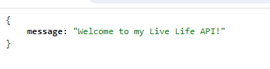
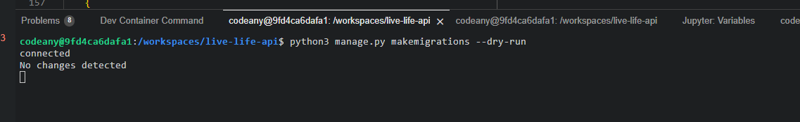

# Live Life API

[Live Life API](https://live-life-api-now-f6f9c42b2398.herokuapp.com/)

[Live Life frontend website](https://.herokuapp.com/)

## Table of contents

# Purpose of the API:
The purpose of the API is to serve as the Back-end for the Front-end of the 5th project for code institute. This is needed for posting and getting data from endpoints and to perform Create, Read, Update and Delete operations to objects entered by Users via Front-end.

# Package Dependencies
- asgiref==3.7.2
- cloudinary==1.38.0
- dj-database-url==0.5.0
- dj-rest-auth==5.0.2
- Django==3.2.23
- django-allauth==0.57.0
- django-cloudinary-storage==0.3.0
- django-cors-headers==4.3.1
- django-filter==23.5
- djangorestframework==3.14.0
- djangorestframework-simplejwt==5.3.1
- gunicorn==21.2.0
- oauthlib==3.2.2
- pillow==10.2.0
- psycopg2==2.9.9
- PyJWT==2.8.0
- python3-openid==3.2.0
- pytz==2023.3.post1
- requests-oauthlib==1.3.1
- sqlparse==0.4.4

- pip install dj-rest-auth==2.1.9
- pip install dj-rest-auth
- pip install 'dj-rest-auth[with_social]'
- pip install djangorestframework-simplejwt==4.7.2

# Deployment and Development

To run the server locally (Debug = True), the following commands are ran during the Developmentof the project:
- python manage.py runserver <- Loads the website on the in-built Terminal.

During development migrations to the database were made.
To make migrations the following commands ran:
- python manage.py makemigrations <- Creates a new database migration
- python manage.py migrate <- Applies pending migrations

To create or update Requirements.txt file the following commands ran:
- pip3 freeze > requirements.txt <- Install req.

To create a Superuser the following command ran.
- python manage.py createsuperuser (username->email->password enter->password verify) <- Creates a Superuser (ignore email input).

## How to Fork

- Log in to Github
- Go to repository for this project.
- Click the fork button in the top right corner

## How to Clone

- Log in(or Sign Up) to Github
- Go to repository for this project
- Click on the code button, select whether you would like to clone with HTTPS, SSH or GitHub CLI and copy the link shown.
- Open the terminal in your code editor and change the current working directory to the location you want to use for the cloned directory.
- Type the following command in the terminal (after the git clone you will need to paste the link you copied in step 3 above)
- Set up a virtual environment.
- Install the packages from the requirements.txt file - run Command pip3 install -r requirements.txt

## ElephantSQL Database

The website uses [ElephantSQL](https://www.elephantsql.com/) for its database.

- I signed up with my GitHub account.
- I created a new instance and the free plan was selected, and Europe was selected as the region.
- I copied the database name for the project and copied the database URL.
- The database URL was put into the Config Vars of Heroku and into a env file of the code.
- Once pip3 install dj_database_url==0.5.0 psycopg2 and a few setting was added and updated.
- A superuser was created in te terminal and the SQL Browser in [ElephantSQL](https://www.elephantsql.com/) under Table queries and auth-user was selected.
- Once Excuted, the superuser details are displayed.

## Cloudinary

The website uses [Cloudinary](https://cloudinary.com/) for storing images.

- I created an account in Cloudinary.
- I copied the API environment variable in Dashboard over to my code.

## Heroku

The website was deployed to [Heroku](https://heroku.com/) by following these steps:

- I created a new app/Project.
- Enter a unique application name, Select your region, Click Create App
- Installed gunicorn into the IDE terminal.
- Make sone updates to the settings, and add allowed hosts and installed apps.
  Add the DATABASE_URL chosen SECRET_KEY value to the env.py file.
- Inside the project settings tab and clicked reveal configuration vars
- I added the following configuration vars: CLOUDINARY_URL, DATABASE_URL, and SECRET_KEY .
- I went to the deploy tab and connected the GitHub repository.
- Update the settings.py file to import the env.py file with SECRETKEY and DATABASE_URL added.
- Add Heroku to the ALLOWED_HOSTS list in settings.py ['app_name.heroku.com', 'localhost']
- Selected Deploy tab and clicked Main branch.
- Clicked on Open app.

## Languages & Technologies
- Django REST Framework (Python Framework - API)
- 
  
## Other forms of development
- [Github](https://github.com/) - Host for the repository
- [Code AnyWhere](https://app.codeanywhere.com/) - Code editor
- [ElephantSQL](https://www.elephantsql.com/) - Database
- [Cloudinary](https://cloudinary.com/) - Static & Media host
- [Heroku](https://dashboard.heroku.com/apps) - Host the live project

## Testing

### Manual test

### Automated tests

### Python validation

All Python code were then validated using the [Code Institute Python Linter](https://pep8ci.herokuapp.com/):

- `profiles/admin.py`: no errors found
- `profiles/models.py`: no errors found
- `profiles/tests.py`: no errors found
- `profiles/serializers.py`: no errors found
- `profiles/urls.py`: no errors found
- `profiles/views.py`: no errors found

- `posts/admin.py`: no errors found
- `posts/models.py`: no errors found
- `posts/tests.py`: no errors found
- `posts/serializers.py`: no errors found
- `posts/urls.py`: no errors found
- `posts/views.py`: no errors found

- `likes/admin.py`: no errors found
- `likes/models.py`: no errors found
- `likes/tests.py`: no errors found
- `likes/serializers.py`: no errors found
- `likes/urls.py`: no errors found
- `likes/views.py`: no errors found

- `followers/admin.py`: no errors found
- `followers/models.py`: no errors found
- `followers/tests.py`: no errors found
- `followers/serializers.py`: no errors found
- `followers/urls.py`: no errors found
- `followers/views.py`: no errors found

- `comments/admin.py`: no errors found
- `comments/models.py`: no errors found
- `comments/tests.py`: no errors found
- `comments/serializers.py`: no errors found
- `comments/urls.py`: no errors found
- `comments/views.py`: no errors found

- `live_lide_api/admin.py`: no errors found
- `live_lide_api/models.py`: no errors found
- `live_lide_api/tests.py`: no errors found
- `live_lide_api/serializers.py`: no errors found
- `live_lide_api/urls.py`: no errors found
- `live_lide_api/views.py`: no errors found

Welcome,

This is the Code Institute student template for Codeanywhere. If you are using Gitpod then you need [this template](https://github.com/Code-Institute-Org/gitpod-full-template) instead.  We have preinstalled all of the tools you need to get started. It's perfectly ok to use this template as the basis for your project submissions.

You can safely delete this README.md file, or change it for your own project. Please do read it at least once, though! It contains some important information about Codeanywhere and the extensions we use. Some of this information has been updated since the video content was created. The last update to this file was: **August 30th, 2023**

## Codeanywhere Reminders

To run a frontend (HTML, CSS, Javascript only) application in Codeanywhere, in the terminal, type:

`python3 -m http.server`

A button should appear to click: _Open Preview_ or _Open Browser_.

To run a frontend (HTML, CSS, Javascript only) application in Codeanywhere with no-cache, you can use this alias for `python3 -m http.server`.

`http_server`

To run a backend Python file, type `python3 app.py`, if your Python file is named `app.py` of course.

A button should appear to click: _Open Preview_ or _Open Browser_.

In Codeanywhere you have superuser security privileges by default. Therefore you do not need to use the `sudo` (superuser do) command in the bash terminal in any of the lessons.

To log into the Heroku toolbelt CLI:

1. Log in to your Heroku account and go to _Account Settings_ in the menu under your avatar.
2. Scroll down to the _API Key_ and click _Reveal_
3. Copy the key
4. In Codeanywhere, from the terminal, run `heroku_config`
5. Paste in your API key when asked

You can now use the `heroku` CLI program - try running `heroku apps` to confirm it works. This API key is unique and private to you so do not share it. If you accidentally make it public then you can create a new one with _Regenerate API Key_.

---

Happy coding!
